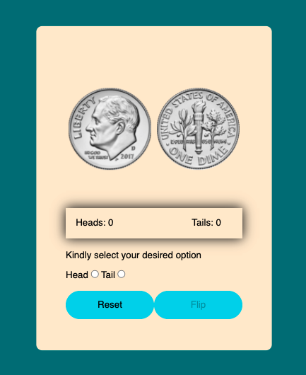

# Flip Coin Game
This game is very nostalgic almost everyone of us played a flip a coin game when we were child 
together with friends,sibling or coucins.  
And who doesn't want to see a computer game version of it? Where we can go back in time when we used 
to play it as little child by playing    its computer version.

## Language used
* HTML
* CSS
* JavaScript

## User Goals

* The goal of this website is for the users to play the game they loved playing as a kid.

## Surface

* Main colors used for this project
    * Background: rgb(4, 119, 128)
    * Game area background : blanchedalmond
    * Font color: Black

## Features
* The Header 
    * The header contais the title of the game which is FLip Coin Game.

* Game Box
    * The game box contais all the features that lets you play the game, it contains the coin both heads and tails, it also cantain the radio   button which lets you choose your desired coin, The score where you can visually see if you choose the right coin or not, Flip button which lets you   flip the coin and lastly the play again button that lets you reset the game.
         
    

* Feature left to implement
     * In the future I would like to implement the feature that lets you continue playing and continue incrementing the score until the player wants to reset the game.

    * For now I want the game to be as simple as how people played the game as a kid, thats why you only have one flip and can only   reach one score in the game for you to win and thats the simplicity of it.
   
## Testing
* Tested that it works on different browsers chrome,safari.
* The project is responsive on mobile devices and other small screen device

## Validator Testing
* HTML
    * No errors were returned when passing through the official [W3C validator](https://validator.w3.org/)

* CSS
    * No errors were returned when passing through the official [W3C validator](https://jigsaw.w3.org/css-validator/)

* JavaScript
    * No errors were returned when passing through the official [Jshint validator](https://jshint.com/)
        * The following metrics were returned

        * There are 3 functions in this file.

        * Function with the largest signature take 1 arguments, while the median is 0.

        * Largest function has 13 statements in it, while the median is 10.

        * The most complex function has a cyclomatic complexity value of 5 while the median is 1.

## Deployment

* The site was deployed to GitHub pages. The steps to deploy are as follows:
    * In the GitHub repository, navigate to the Settings tab
    * From the source section drop-down menu, select the Master Branch
    * Once the master branch has been selected, the page will be automatically refreshed with a detailed ribbon display to indicate the successful deployment.
* The live link can be found here - https://mcp321.github.io/heads-or-tails/

## Credits

* [W3schools](https://www.w3schools.com/) For ideas on how to properly use some codes.
* mysterycode, coding artist and coding nepal's youtube channel for inspiration about the game.

## Acknowledgements
* My mentor for the very good planning, suggestions and for not giving up on me.
* Tutor suppor for always being there when needed. 

